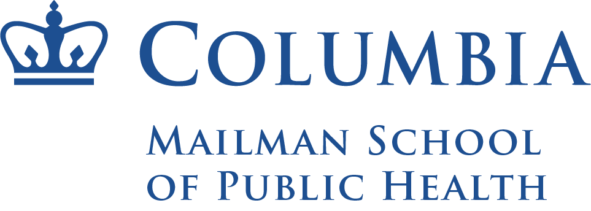

 

## Education 
**[Columbia University, Mailman School of Public Health](https://www.publichealth.columbia.edu/)**, New York, NY (May 2023)  
**Master of Public Health (MPH)** *in [Epidemiology](https://www.publichealth.columbia.edu/academics/degrees/master-public-health/columbia-mph/mph-epidemiology), Certificate in [Applied Biostatistics and Public Health Data Science](https://www.publichealth.columbia.edu/academics/degrees/master-public-health/certificates/applied-biostatistics-and-public-health-data-science)*  
GPA: 3.9  
•	Thesis: *"Geographical Surveillance of COVID-19 clusters in New York City: A Comparison Between Space-Time Scan Statistics in SaTScan and Emerging Hotspot Analysis in ArcGIS"*  
• Relevant Coursework: Epidemiology I-III, Applied Regression Analysis I & II, Analysis of Categorical Data, Statistical Computing with SAS, Relational Databases and SQL Programming, Data Science/R, Public Health GIS/ArcGIS  
 
**[University of Washington (UW)](https://www.washington.edu/)**, Seattle, WA (June 2019)  
**Bachelor of Arts** *in [Public Health-Global Health](https://sph.washington.edu/phgh), Minor in [Nutritional Sciences](https://nutr.uw.edu/undergraduate/nutrition-minor/)*  
GPA: 3.6

 

## Work & Research Experience
**Columbia University, Department of Epidemiology**, New York, NY (July 2023 – Present)  
*Statistician*  
•	Supporting [Dr. Kara Rudolph's](https://www.publichealth.columbia.edu/profile/kara-rudolph-phd) epidemiology research team with interests in developing and applying causal inference methods to understand social and contextual influences on mental health, substance use, and violence in disadvantaged, urban areas of the United States.  

**[SOMOS Innovation](https://somosinnovation.com/)**, New York, NY (January 2023 – May 2023)  
*Senior Business Intelligence Analyst*  
•	Designed and implemented market intelligence efforts using Excel and R to report on healthcare market trends and compare against SOMOS' performance, utilizing data on plan enrollments, premiums, expenses, costs, and utilization rates. See code produced to analyze health plan enrollment data [here](https://github.com/sarah-forrest/cms_enrollment_data/blob/main/cms_enrollment.md)  
•	Established reporting on benchmark performance comparisons for emerging dual-eligible government programs such as MAP and PACE, integrating Medicaid and Medicare benefits for complex populations.  

**Columbia University, Department of Biostatistics**, New York, NY (September 2022 – May 2023)  
*Graduate Teaching Assistant*  
•	Improved student learning outcomes and statistical analysis skills for Statistical Computing with SAS & Applied Regression courses by facilitating discussion and providing effective feedback to 100+ students from non-technical backgrounds.  
•	Created video tutorials introducing students to the SAS interface and teach fundamentals of statistical programming.  

**Columbia University, [Geospatial and Applied Prevention Science Lab](https://www.thegapslab.org/)**, New York, NY (February 2022 – August 2022)  
*Graduate Research Assistant*  
•	Investigated associations between urban design, child mobility, and crash risks in California cities, to support a NIH grant proposal informing how best to configure transportation networks to reduce crash incidence and minimize health inequities.  
•	Created statistical models to predict mobility using mixed linear regression and multinomial logistic regression in SAS and R.  
•	Extracted and cleaned mobility data for 3,000+ children in over 250 cities from publicly available data sources using SAS.  
•	Created graduated color maps of urban design measures for California cities using Geographic Information Systems in ArcGIS and R to confirm accuracy of variable calculations.  
•	Created compelling data visualization, summary tables, and model result reports in R for publication and presentation. See research poster [here](images/Forrest_Sarah_APExPoster.pdf){width=100%}  
•	Conducted a comprehensive review of available literature on spatial epidemiology and children’s mobility research.  

**Department of Veteran's Affairs, [Seattle Epidemiologic Research & Information Center (ERIC)](https://www.seattle.eric.research.va.gov/)**, Seattle, WA (October 2020 – August 2021)  
*Human Subjects Research Assistant*, [Vietnam-Era Twin (VET) Registry](https://www.seattle.eric.research.va.gov/VETR/Home.asp)  
• •	Created and coded queries from a complex data set of 14,000+ individuals and 30+ different studies (surveys, medical records, biospecimen data) over 30 years; accurately recorded data and created reports in MS Access and Excel and presented weekly updates to Team to improve veterans' health using epidemiologic research.  
• Developed three study procedures, recruitment scripts, and trained new staff to ensure consistency and reliability.  
• Successfully recruited and followed up with 500+ research participants through phone and written correspondence.  
• Accurately prepared documentation for Institutional Review Board (IRB) submissions.  
• Collaborated with senior subject matter experts and researchers in three locations across the United States.  

**[University of Washington Food Pantry](https://www.washington.edu/anyhungryhusky/the-uw-food-pantry/)**, Seattle, WA (January 2019 – August 2019)  
*Fresh Food and Sustainability Intern*  
• Spearheaded the development of sustainable food recovery strategies to supply the Pantry with fresh meals and produce.  
• Established working relationships and maintained frequent communication with community partners to facilitate donations.  
• Established a 5-person team to recover food from scratch by recruiting, training, and leading student volunteers.  

**University of Washington Health Promotion Office**, Seattle, WA (January 2019 – June 2019)  
*Pre-Exposure Prophylaxis Assessment Lead*  
• Collaborated with an interdisciplinary team and conducted literature reviews to inform the creation of a research question examining the barriers and facilitators to accessing HIV services by LGBTQIA students on the UW campus.  
• Developed a survey that received 90+ responses and coded responses in Excel to visualize data and identify themes.  
• Presented research findings to university administrators at the UW Student Well-Being Collaborative and proposed recommendations to reduce barriers by emphasizing patient anonymity and insurance coverage of PrEP.  

**[South King County Food Coalition, Elk Run Farm](http://www.skcfc.org/elk-run-farm.html)**, Maple Valley, WA (June 2018 – September 2018)  
*AmeriCorps VISTA Summer Associate*  
• Maintained thorough and consistent records of all harvest data necessary for grant applications using Excel.  
• Coordinated promotion of events, created marketing materials, produced a bi-weekly newsletter, and publicized opportunities through social media to recruit community members and maintain a volunteer-based workforce.  
• Created and launched an 8-week paid internship program for an incoming cohort of high school students to teach key concepts in sustainable agriculture and career development skills.

 

## Honors & Distinctions
**University of Washington Honors Program, [Bonderman Fellowship](https://bonderman.uw.edu/)** (September 2019 – March 2020)  
*Bonderman Fellow*  
•	Selected as one of 9 undergraduate students out of a graduating class of 8,000+ for the highly competitive travel fellowship intended for fellows to engage deeply with peoples and communities across the world. See profile [here](https://bonderman.uw.edu/fellows/sarah-forrest/)  
•	Independently traveled for 6 continuous months in South America and Southeast Asia to investigate systems of public health and explore multicultural approaches to wellness and modes of healing across 7 different countries.  
•	Countries visited include Brazil, Colombia, Peru, Argentina, Chile, Thailand, Malaysia, Vietnam, and India.  

**Public Health Departmental Honors** | UW School of Public Health (February 2018 – June 2019)  
**Annual Dean’s List** | UW Office of the Registrar (September 2017 – June 2019)  
**Quarterly Dean’s List** | UW Office of the Registrar (September 2015 – June 2019)

 

## Presentations
Columbia University Epidemiology Masters Student Day, New York, NY. “*Urban Design and Mobility Among Children Aged 5-15 in California Cities in 2017,*” November 4, 2022  

University of Washington School of Public Health Undergraduate Symposium, Seattle, WA. “*Public Opinion and Stakeholder Perspectives on Supervised Injection Facilities and Syringe Service Programs in Seattle, WA,*” May 23, 2019

 

## Skills
**Computer**: Strong knowledge of MS Office (Word, Excel, Access, PowerPoint), SAS, R, SQL, ArcGIS/QGIS, SaTScan, GeoDa, and REDCap  
**Certifications**: CITI (human subjects research), HIPAA (patient privacy), VA Human Subjects Protection training and certification  
**Language**: Intermediate Spanish, extensive travel in 12 countries in Central America, South America, and Southeast Asia

 

